# Data Quality Assessment

## Luminosity Values
This first set of figures presents nighttime lights composites from 2021 for the Pacific Islands, generated through Google Earth Engine by averaging non-cloudy observations.

````{tab-set}
``` {tab-item} Papua New Guinea

```
``` {tab-item} Federated States of Micronesia

```
``` {tab-item} Fiji

```
``` {tab-item} Kiribati

```
``` {tab-item} Marshall Islands
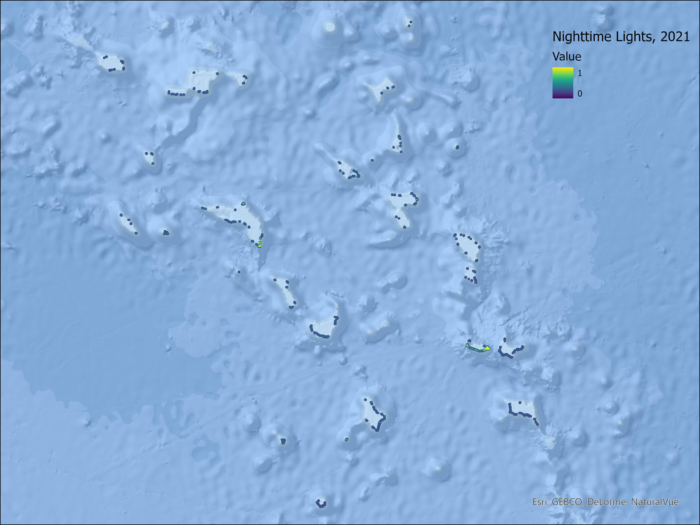
```
``` {tab-item} Nauru

```
``` {tab-item} Palau

```
``` {tab-item} Samoa

```
``` {tab-item} Solomon Islands

```
``` {tab-item} Tonga

```
``` {tab-item} Tuvalu
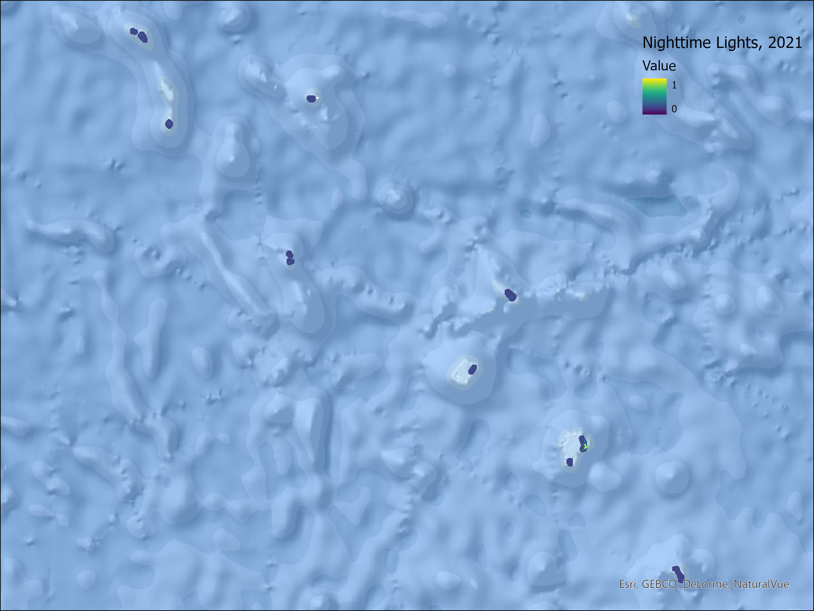
```
``` {tab-item} Vanuatu
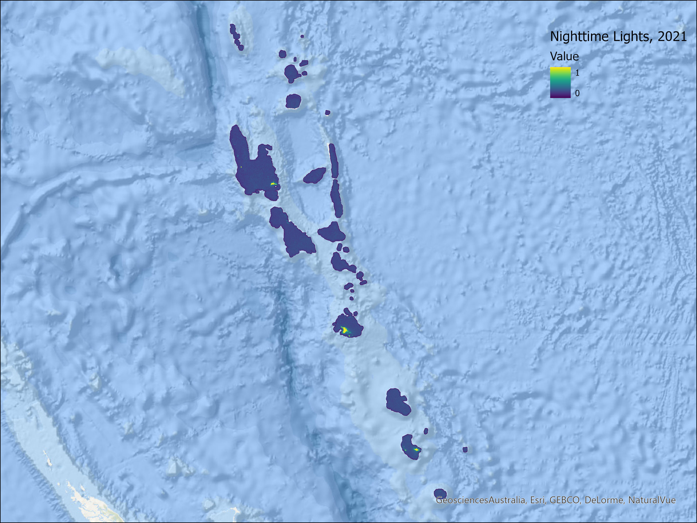
```
````

## Cloud Coverage by Country
This second set of figures examines the number of pixels that contain invalid light measurements due to clouds.
````{tab-set}
``` {tab-item} Papua New Guinea
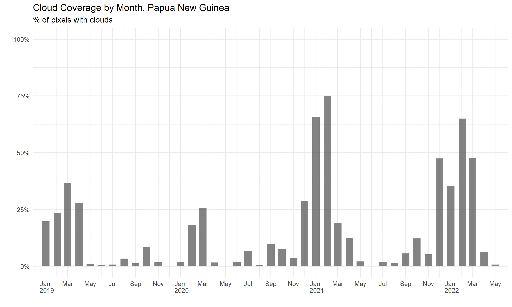
```
``` {tab-item} Federated States of Micronesia
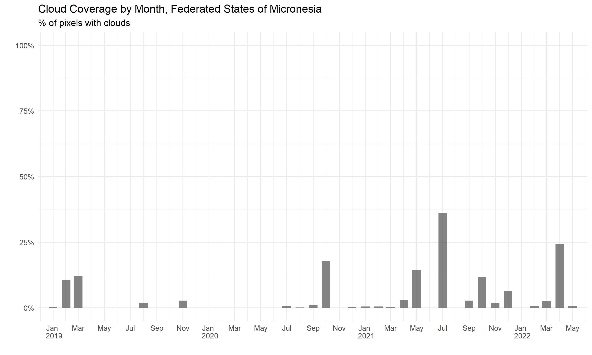
```
``` {tab-item} Fiji
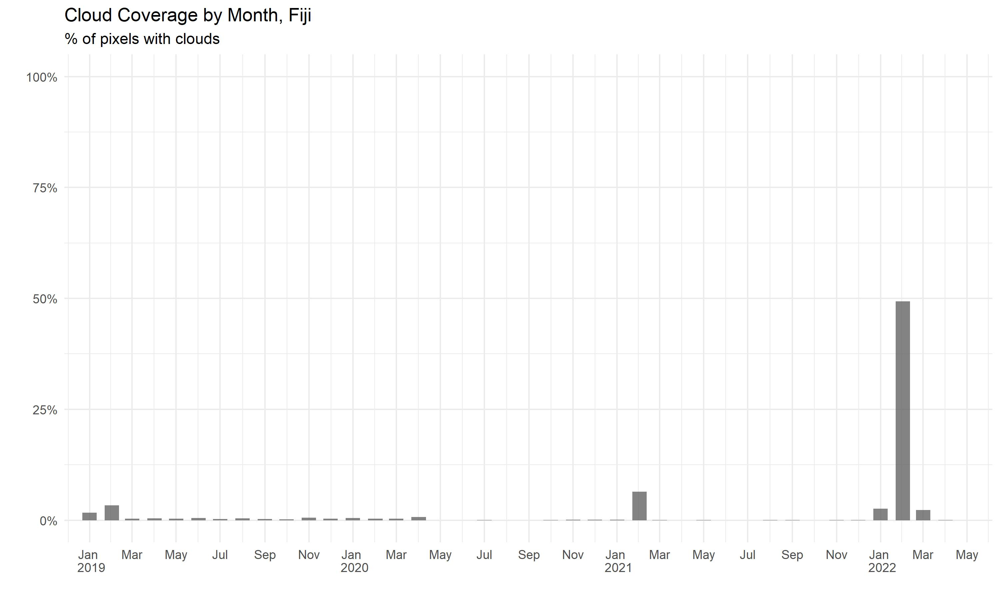
```
``` {tab-item} Kiribati
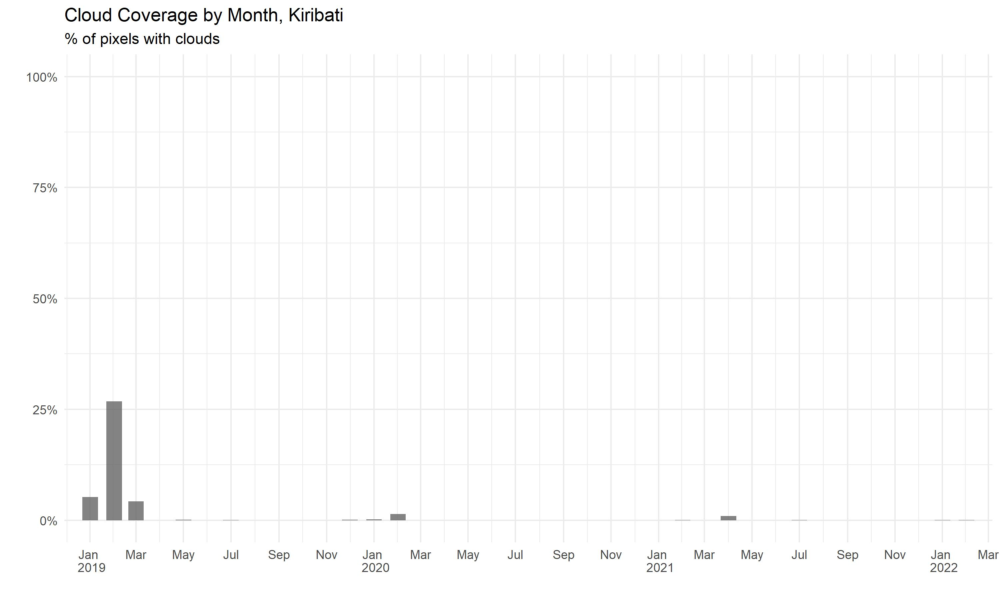
```
``` {tab-item} Marshall Islands
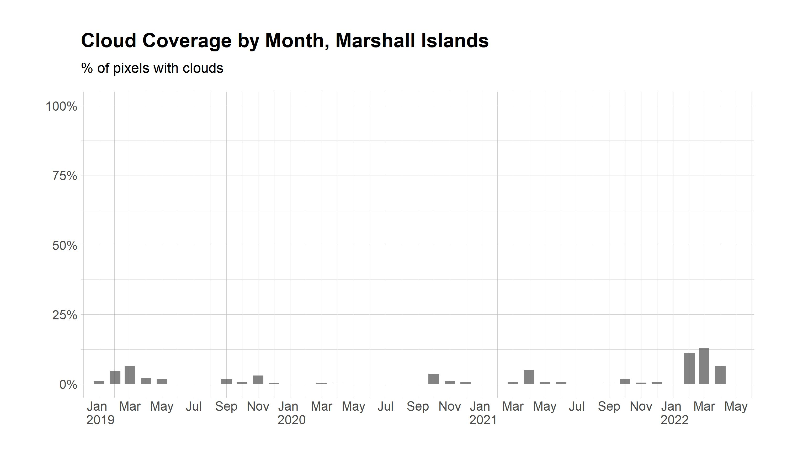
```
``` {tab-item} Nauru
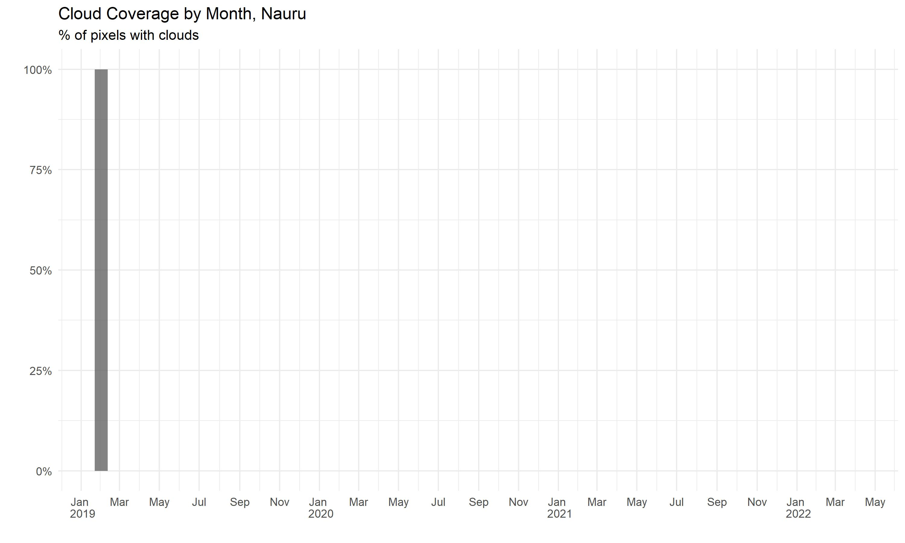
```
``` {tab-item} Palau
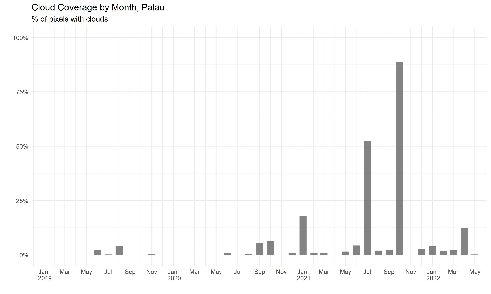
```
``` {tab-item} Samoa
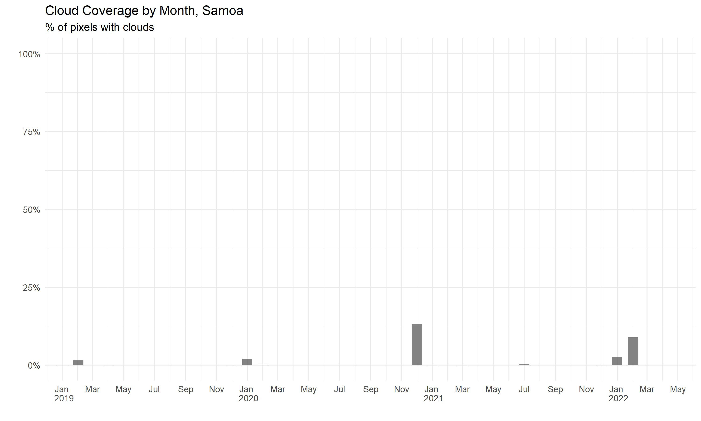
```
``` {tab-item} Solomon Islands
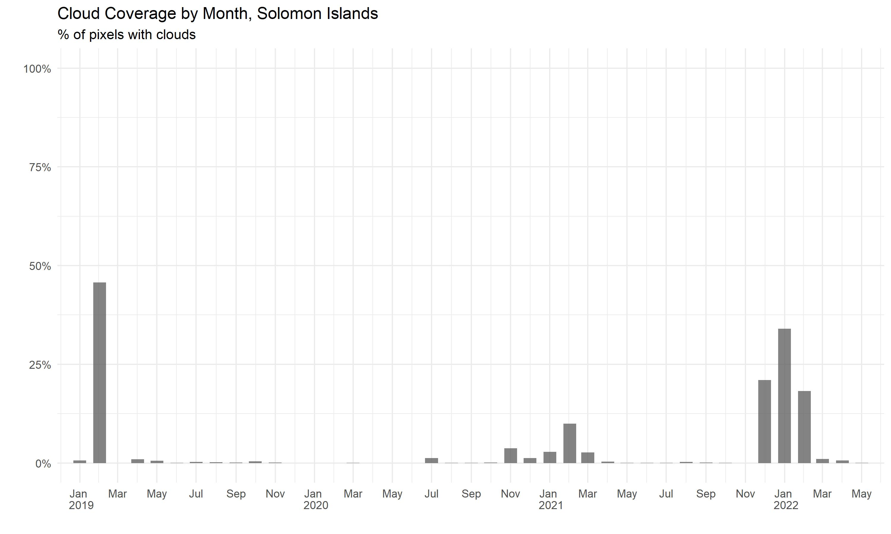
```
``` {tab-item} Tonga
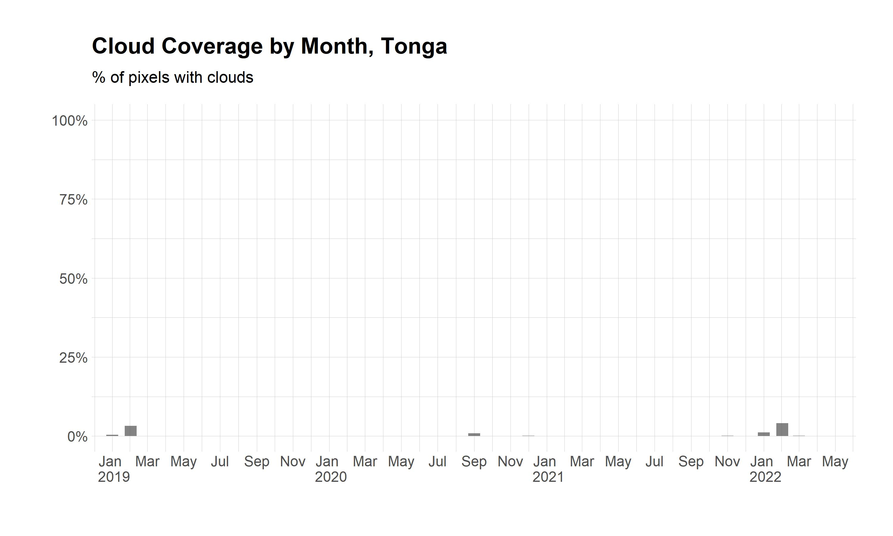
```
``` {tab-item} Tuvalu
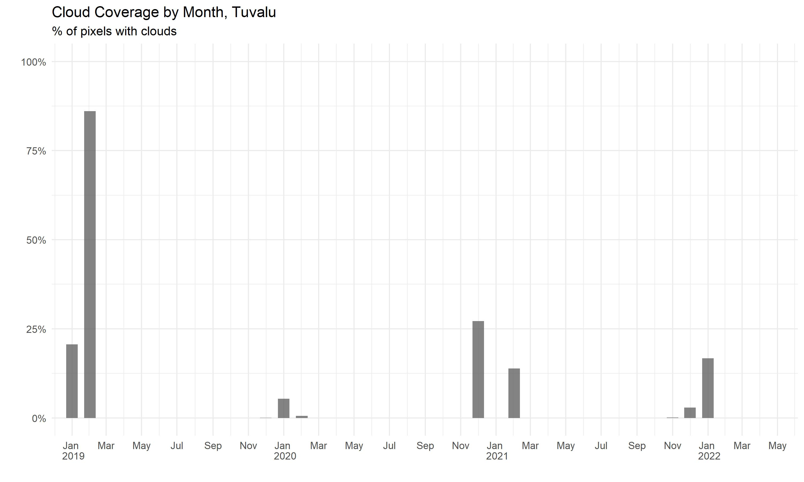
```
``` {tab-item} Vanuatu

```
````