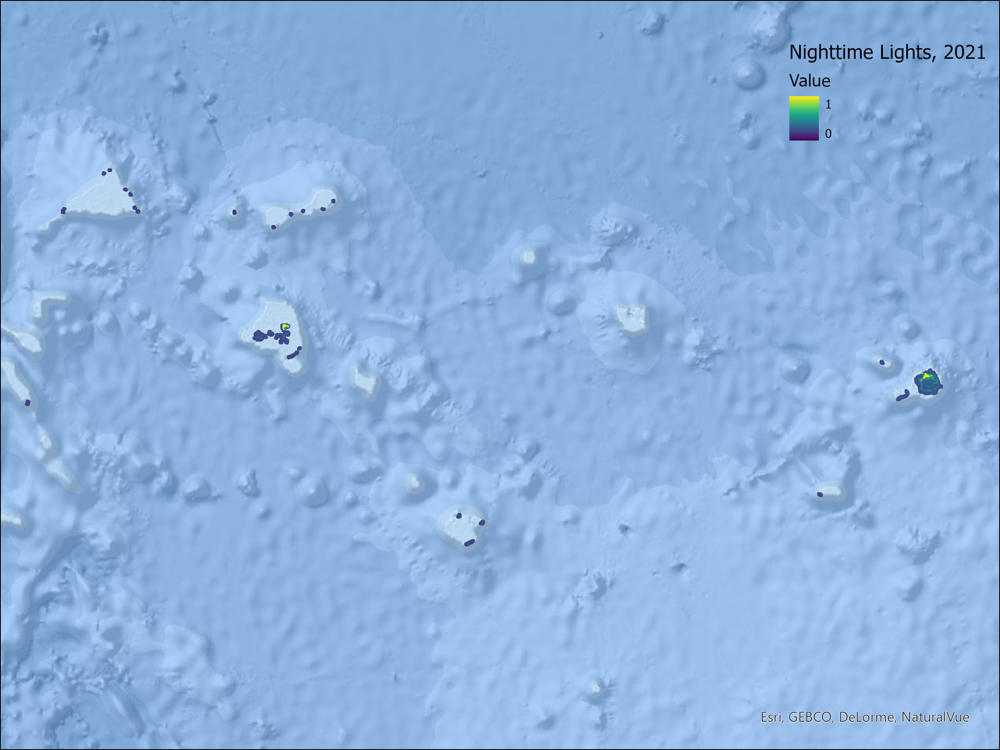
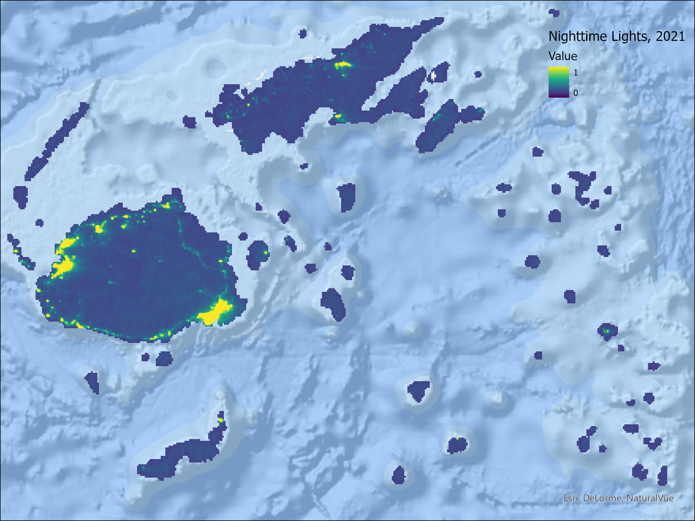
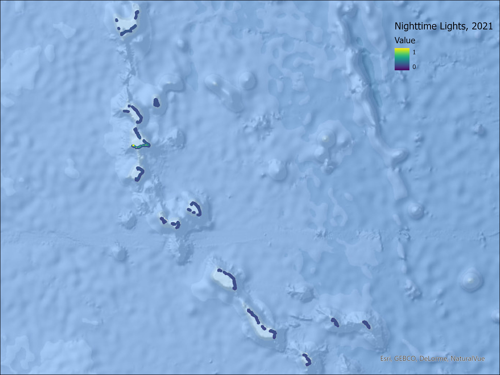
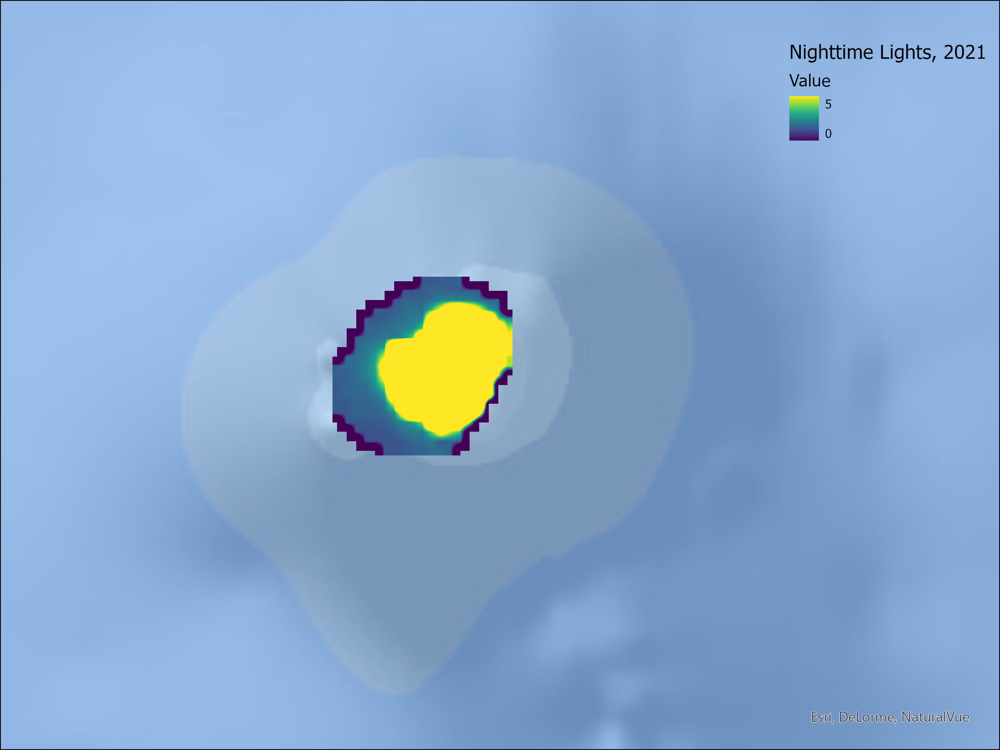
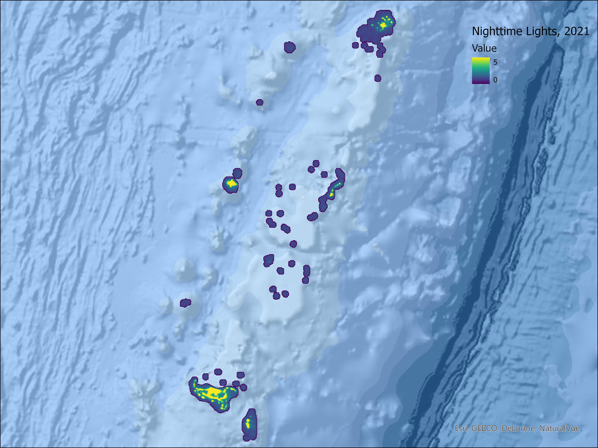
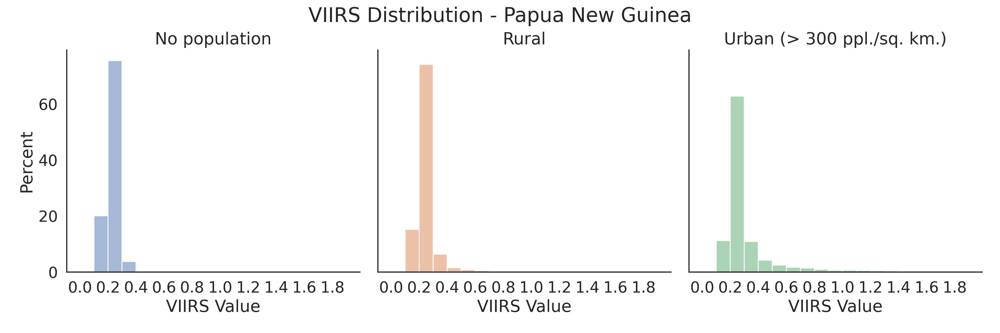
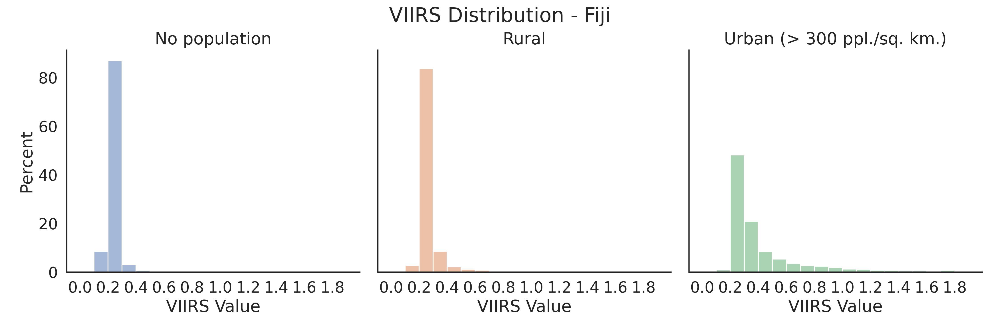
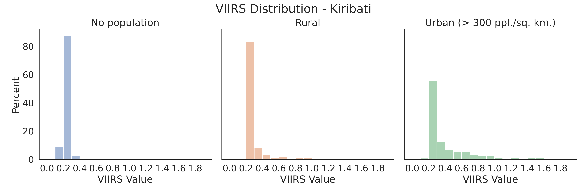
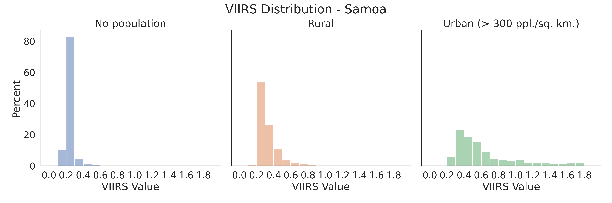

# Data Quality Assessment

In this section we examine the distribution and temporal quality of nighttime lights data from the VIIRS satellite for selected Pacific Islands. All analytical steps were implemented in python leveraging the Google Earth Engine API. Annotated notebooks to replicate the analysis can be found in the Pacific Observatory github repository. Maps and graphs for all islands are available on the online version of this technical note.

## Annual Maps of Lights
The first set of maps in figure 3-1 presents maps of nighttime lights for the year 2021. We generated raw annual composites for each island by averaging the radiance value from monthly images after removing non-cloudy observations. Lights are visualized on a scale from dark purple (0) to bright yellow (radiance value greater than or equal to 1 nanoWatts/cm2/sr).

````{tab-set}
``` {tab-item} Papua New Guinea

```
``` {tab-item} Federated States of Micronesia

```
``` {tab-item} Fiji

```
``` {tab-item} Kiribati

```
``` {tab-item} Marshall Islands

```
``` {tab-item} Nauru

```
``` {tab-item} Palau

```
``` {tab-item} Samoa

```
``` {tab-item} Solomon Islands

```
``` {tab-item} Tonga

```
``` {tab-item} Tuvalu

```
``` {tab-item} Vanuatu

```
````

NTL values for most areas are low, with higher values clustered around human settlements. Beyond cities and towns, in some islands it is possible to identify infrastructure features, such as roads along coastal areas. Low radiance values are hard to interpret as the satellite is very sensitive to various sources of light. For reference, previous studies have noted radiance values for specific features: 3.28 for a bridge, and 3.65 for a vessel (Cao and Bai 2014).

One would expect radiance values for populated areas to be higher, though previous studies have warned that rural areas may not be detected. This assumption can be investigated further by matching the NTL composite with a population grid. In this case, we use Facebook’s High Resolution Settlement Layer, which mapped the distribution of human population at a resolution of 30m. This population layer was generated by combining census data with computer vision techniques and is available for all islands.

After matching the population data to the VIIRS annual composites, we created histograms of VIIRS values for different population density thresholds. Figure 3-2 presents histograms for Fiji and Samoa, where the left panel shows the distribution of light values for unpopulated areas, the center is for rural areas, and the right is for urban areas, defined as cells with population density higher than 300 people per square kilometer. Although the distribution for all graphs is heavily skewed towards 0, populated areas show a longer tail of pixels with slightly higher luminosity values.

````{tab-set}
``` {tab-item} Papua New Guinea

```
``` {tab-item} Federated States of Micronesia

```
``` {tab-item} Fiji

```
``` {tab-item} Kiribati

```
``` {tab-item} Marshall Islands

```
``` {tab-item} Nauru

```
``` {tab-item} Palau

```
``` {tab-item} Samoa

```
``` {tab-item} Solomon Islands

```
``` {tab-item} Tonga

```
``` {tab-item} Tuvalu

```
``` {tab-item} Vanuatu

```
````

We ran a similar test with a better annual composite. Elvidge et al. developed a methodology to remove background noise, solar and lunar contamination, and features unrelated to electric lighting (aurora, fires, flares, volcanoes) (2021). We retrieve the latest “clean” annual composite from the Earth Observation Group at the Payne Institute for Public Policy. With this cleaned data, values of 0 are defined as non-lit background, and any value above 0 can be attributed to anthropogenic lights. Table 1 presents the share of pixels with lights, by unsettled, rural, and urban areas. Urban areas are relatively well captured in NTL, and a very small share of rural pixels seem to be emitting light. Tonga and Nauru have high shares for rural pixels, but they are also locations with high mining and volcanic activity.

**Table 1: % Pixels with lights in the cleaned VIIRS 2021**
```{list-table}
:header-rows: 1

* - Country
  - No population
  - Rural
  - Urban (> 300 ppl. /sq. km.)
* - Federated States of Micronesia
  - 6.2%
  - 31.0%
  - 53.1%
* - Fiji
  - 1.6%	
  - 22.0%
  - 69.6%
* - Kiribati
  - 1.5%
  - 9.8%
  - 30.6%
* - Marshall Islands
  - 5.1%
  - 24.8%
  - 73.6%
* - Nauru
  - 88.2%
  - 100.0%
  - 100.0%
* - Palau
  - 8.3%
  - 59.4%
  - 100.0%
* - Papua New Guinea
  - 0.2%
  - 3.4%
  - 15.1%
* - Samoa
  - 3.5%
  - 26.8%
  - 78.7%
* - Solomon Islands
  - 0.1%
  - 2.0%
  - 12.5%
* - Tonga
  - 18.5%
  - 72.6%
  - 96.9%
* - Tuvalu
  - 5.5%
  - 4.9%
  - NA
* - Vanuatu
  - 0.4%
  - 5.3%
  - 31.3%
```

## Cloud Coverage

Many of the applications discussed in section 2 take advantage of the temporal cadence of nighttime lights to derive trends. Researchers should be cautious in assessing the consistency of time-series observations before drawing economic interpretations from the trends. The following analysis examines what percentage of area for each island had data that was affected by clouds.

The monthly VIIRS composites are based on the average value from daily scenes. The authors of the dataset also provide a quality-control image specifying how many valid observations were available to calculate the monthly value. In some areas, there is not one day from the entire month with a cloud-free observation available. Figure 3-3 shows the percentage of pixels without any valid data for each month from 2019 to 2022 in Papua New Guinea and Marshall Islands. Clouds are particularly disruptive in the wet season (December to March), with no coverage available for more than 50% of the area in PNG for 2021 and 2022. The disruption is less drastic in smaller islands but can still be significant when computing an average value.

````{tab-set}
``` {tab-item} Papua New Guinea

```
``` {tab-item} Federated States of Micronesia

```
``` {tab-item} Fiji

```
``` {tab-item} Kiribati

```
``` {tab-item} Marshall Islands

```
``` {tab-item} Nauru

```
``` {tab-item} Palau

```
``` {tab-item} Samoa

```
``` {tab-item} Solomon Islands

```
``` {tab-item} Tonga

```
``` {tab-item} Tuvalu

```
``` {tab-item} Vanuatu

```
````

A light-weight approach to mitigate issues with cloud coverage is to interpolate missing timesteps with valid observations from nearby months. To test this approach, we implemented a pixel-level moving window linear regression that uses values from 3 months before and after each observation. Figure 3-4 displays an example of this approach for Lae. The raw data shows drastic drops in NTL which can be attributed to months with high cloud coverage. The interpolated trend is more stable and shows much more continuity despite slight increases/decreases.

```{figure} ./images/Lae_VIIRS_Interpolation.png
:name: lae-interpolation

Figure 3.4: Interpolation of NTL time-series
```