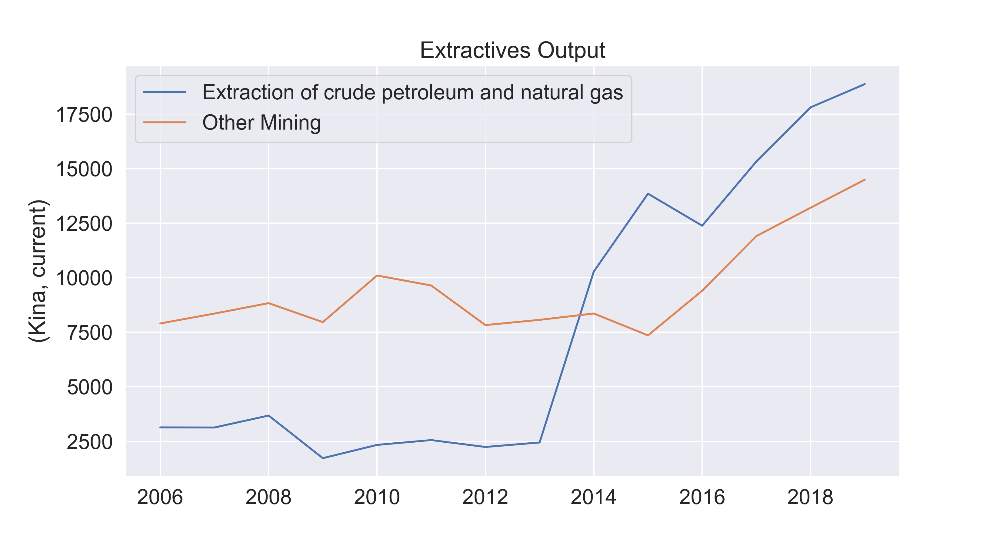

# Economic Applications

In this section we investigate how well signals from nighttime lights can approximate economic measures in Papua New Guinea. We test the suitability of NTL data to proxy economic statistics in this country as a significant portion of its economy is composed by industrial production and extractives, which are more likely to be captured by NTL. Additionally, there is significant variance in terms of poverty levels, and we are interested in knowing whether lights can capture any of that variance. While PNG is exceptional in the region due to its size, we examine other applications that may extend better to smaller islands in section 5.

## Extractives
From our earlier inspection of annual composites, it was evident that mining sites produced high levels of lights in PNG. In a country that is predominantly rural, sites of extractive operations (Ok Tedi, Porgera, Hides, Agogo, and Iagifu) produce radiance measures higher than what is captured in major cities. Some of these sites are mining operations where the infrastructure built might have their lights on overnight, and they might have caused spillover settlement growth. Others are processing facilities connected to the Liquified Natural Gas pipeline, where NTL may be detecting episodes of flaring. Our hypothesis is that changes in the radiance levels detected in these locations may be related to changes in mining production or economic output.

### *Methodology*
We built a database of mining sites and gas facilities by reviewing an official map and confirming their geo-location through crowd-sourced data . We drew 4-kilometer buffers around each site and calculated the sum of lights (SoL) for each site at the monthly and annual frequency. For the monthly time series, we rely on the VIIRS monthly images (2014-2022) and follow the moving-window linear interpolation described in section 3.3.

For the annual time series, we rely on two sets of NTL data: the VIIRS annual composites generated by the Earth Observation Group (2013-2021), and the DMPS-OLS annual composites provided by NOAA (1992-2013). Multiple differences between satellites make it challenging to combine statistics from both datasets. To address this, we follow the harmonizing technique developed by Daynan Crull. This method uses the overlap between both platforms for a locally defined region of interest (in this case, PNG), applies various transformations and fits the DMSP composites to VIIRS using a Gradient Boosting decision-tree based algorithm (forthcoming ). We calculated sum of lights from the harmonized annual images and summarized national aggregates of lights per type of operation (mining or gas).

To compare this with economic measures, we curated national sector-level GDP from the latest published national accounts - 2006 to 2019 (PNG National Statistics Office), and facility-level production reported through the Extractives Industry Transparency Initiative 2019 Report (EITI). Only selected facilities have reported the amount of gold or copper mines in the last few years (typically 2014 to 2019).

<!-- ```{figure}
A | B
- | - 
 | 

Figure 4.1: National Aggregates. Left: output (PNG NSO), right: sum of lights (DMSP/VIIRS)
``` -->

<!-- ````{panels}
:container: container-fluid 
:column: col-lg-6 col-md-6 col-sm-6 col-xs-12 
:card: shadow-none border-0

```{figure} ./images/Output_Mining_Gas.png
:width: 100%
:name: output-mining-gas

Figure 4.1.a: National Aggregates. Output (PNG NSO)
```

---

```{figure} ./images/Lights_Mining_Gas.png
:width: 100%
:name: lights-mining-gas

Figure 4.1.b: National Aggregates. Sum of lights (DMSP/VIIRS)
```

```` -->

````{list-table} Figure 4.1: National Aggregates
:header-rows: 1

* - Output (PNG NSO)
   - Sum of lights (DMSP/VIIRS)
* - 
   - 
````

Figure 4-1 shows the national account output for the extractive industries, and the sum of lights after aggregating data from all locations in PNG. We investigated the degree of correlation by applying a natural logarithmic transformation to both series and comparing the difference in logged values year-to-year. To test their degree of correlation we specified the following linear regression, where the coefficient c1 can be interpreted as a growth elasticity index.

$$
Δ ln⁡(output) = c0 + c1 * Δ ln(sum \ of \ lights)
$$

### *Results*
Although both time series show an upward trend in figure 4-1, aligning the data by type of industry with log differences highlights varying levels of agreement for mining and gas (see figure 4-2). Changes between lights and output do not correlate for mining but seem to have a stronger agreement for gas. Lights captured the strong increase in gas production in 2014, and changes in years prior (2007 to 2010) align well. This is further confirmed by our regression results. The elasticity found between lights and output for gas is significant at 0.98, while the coefficient for mining is -0.07 and not significant.

<!-- ```{figure}
A | B
- | - 
 | 

Figure 4.2: Log Difference Output and Lights. Left: Mining, right: Petroleum and natural gas
``` -->

<!-- ````{panels}
:container: container-fluid 
:column: col-lg-6 col-md-6 col-sm-6 col-xs-12 
:card: shadow-none border-0

```{figure} ./images/Lights_Mining_LogDiff.png
:width: 100%
:name: mining-log-diff

Figure 4.2.a: Log Difference Mining Output and Lights
```

---

```{figure} ./images/Lights_Gas_LogDiff.png
:width: 100%
:name: gas-log-diff

Figure 4.2.a: Log Difference Gas Output and Lights
```

```` -->

````{list-table} Figure 4.2: Log Difference Output and Lights
:header-rows: 1

* - Mining Output and Lights
   - Gas Output and Lights
* - 
   - 
````

The static trend in lights for recent years (2019 to 2021) signals that gas production has remained constant. Despite the strong correlation found for gas, the possibility to extend this use case to a predictive framework is limited. With no production values available at the site-level, there are not enough observations to properly test a predictive model.

Production values are available for mining sites. However, we found that changes in total luminosity do not correlate to changes in the amount of copper or gold that is mined at the site-level. For example, in Porgera we see a slight increase in annual lights which is not reflected in their production values. We observe more movement in the monthly VIIRS time series for mining sites. Monthly lights can be a useful indicator to examine whether a given mine is active or inactive. An interactive application to examine these trends is publicly available at: https://afche18.users.earthengine.app/view/png-mining.

## Poverty Mapping

Even though light output is extremely low in rural areas in Papua New Guinea (as seen in table 1), we tested the correlation between NTL metrics and a cross-section of province-level poverty rates. For this exercise we used a relative wealth index constructed from the latest DHS survey available (2016 to 2018). This index follows the methodology developed by DHS to summarize wealth based on household assets and amenities.

The clean NTL annual composite for 2019 contains valuable information about the distribution of wealth across provinces. The statistic with the highest correlation to relative wealth is the share of settled area with lights (r = 0.705). Sum of lights was also correlated but with a lower coefficient (0.58). This suggests that the extent of lights is more indicative of poverty than the intensity of lights. Overall, the correlations identified hint that NTL statistics can be used as supplementary features to map the distribution of poverty at more local levels.

```{figure} ./images/wealth-and-lights.jpeg
:name: wealth-lights

Figure 4.3: Correlation between relative wealth and area of lights
```