## Prerequisites

To run the following files, you need to change `PROJECT_FOLDER_PATH` at the `config.py` and make sure that you have the compatible [ChromeDriver](https://googlechromelabs.github.io/chrome-for-testing/) saved in the `/scripts` folder (check the version of the installed Chrome Browser, e.g. `120.0.6099.199` and your OS, e.g. `mac-arm64/mac-x64/win32/win64/linux64`).

After downloading the compatible ChromeDriver:

```
conda create --name <ENV_NAME>
conda activate ENV_NAME
pip3 install -r requirements.txt
```

## Introduction

After fulfilling the prerequisites, you can run the scripts to update or scrape all available news:

- Change `SCRAPE_ALL` to  `True` if you want to scrape all news, meaning disregarding the previously scraped data, or keep the default value of `SCRAPE_ALL` (`False`);

- Examine the provided URLs. For example, [SIBC](https://www.sibconline.com.sb/?s&post_type=post&paged=1) has **1334** Pages that contain more than 9300 news entries (as of Jan 23, 2024). If re-scraping is needed, one needs to check how many pages to scrape and change `SIBC_PAGE_URLs`.

    ```
    # make sure you are at the scripts folder or project folder
    cd ../
    python3 -m scripts.solomon_islands.sibc
    ```

- Seldomly, the website might change the way it developed, meaning the web element has been changed and the scraper may not scrape the element we want. Therefore, one needs to inspect the Webpage and modify the elements.

## Process

```mermaid
graph TD;
    A[Calling Scraper] --> B[Scrape up-to-date news URLs and Overwrite the previous URL files];
    B --> |SCRAPE_ALL=True| C[Scrape all URLs obtained and Overwrite];
    B --> |SCRAPE_ALL=False| D[Scrape URLs ∈ Updated \ Existing and Overwrite];
```



## Files Information

- :white_check_mark: `config.py`: the configuration file that contains the scraping-related information, such as URL, HTTP elements, country code, etc.

### Pacific Islands (General)

- :white_check_mark: `abc_au.py` scrapes the [ABC Australia](https://www.abc.net.au/).
- :white_check_mark: `rnz.py` scrapes [Radio New Zealand](https://www.rnz.co.nz/)'s articles.
- :white_check_mark: `pina.py` scrapes [Pacific News Service](https://pina.com.fj/)'s articles and produces `data/text/pacific/pac_news_after_2020.csv`.

### Fiji

- :white_check_mark: `fiji_sun.py` scrapes [Fiji Sun](https://fijisun.com.fj/) from 2008-05-04.

### Papua New Guinea

- :white_check_mark: `post_courier.py` scrapes [Post Courier](https://www.postcourier.com.pg/) from 2015-12-16.
- :white_check_mark: `png_business.py` scrapes [PNG Business News](https://www.pngbusinessnews.com/) 2019-05-24

### Samoa

- :white_large_square: `samoa_observer.py` scrapes [Samoa Observer](https://www.samoaobserver.ws/) from 2012-01-01.

### Solomon Islands

- :white_check_mark: `solomon_star.py` scrapes [Solomon Star](https://www.solomonstarnews.com/).
- :white_check_mark: `solomon_times.py` scrapes [Solomon Times](https://www.solomontimes.com/).
- :white_check_mark: `island_sun.py` scrapes [The Island Sun](https://theislandsun.com.sb/).
- :white_check_mark: `sibc.py` scrapes [Solomon Islands Broadcasting Companies](https://www.sibconline.com.sb/).

### Vanuatu

- :white_check_mark: `dailypost_vu.py` scrapes [Daily Post](https://www.dailypost.vu/)'s articles 2014-04-08.

### Tonga

- :white_check_mark: `matangi.py`: the script that scraped [Matangi Tonga](https://matangitonga.to)'s news 1997-11-04.
